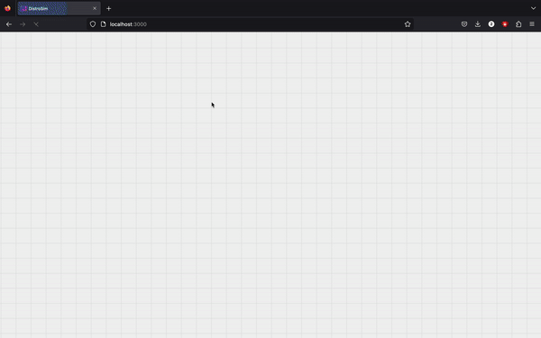

### Hi there ✌️ my name is
# Tikhon Belousov

I'm a software developer interested
in __web development__ (front-end, back-end, fullstack),
__cybersecurity__, __systems development__, __programming languages__
and a lot of other programming-related topics.

## Table of contents
- [Education](#education)
- [Portfolio](#portfolio)
- [Skills](#skills)
- [Badges](#badges)
- [Contacts](#contacts)

## Education
I am presently pursuing my __Bachelor's degree__ in __Applied Computer Science in English__ at __Wroclaw University of Science and Technology__. My Grade Point Average (GPA) stands at __5.4__ out of a __maximum of 5.5__.

## Portfolio
Here I feature and highlight my best projects that I'm proud of:
1. *__Toy programming language__* ([Source code](https://github.com/it1shka/toylang))   An interpreted scripting language implemented
with zero dependencies in ~5k lines of modern C++17 using RAII.
2. *__Distrosim__* ([Source code](https://github.com/it1shka/distrosim))  

Fullstack application for distributed systems simulations.
Back-end in Golang, front-end in Vanilla TypeScript
3. *__Online Tic Tac Toe__* ([Source code](https://github.com/it1shka/tictactoe-online))  

Fullstack application with WebSockets server, built-in chat
and fascinating interface.
4. *__Travelling Salesman Visualiser__* ([Source code](https://github.com/it1shka/tsp-visual))  

Application built to visualize TSP problem.
5. *__Messenger__* ([Source code](https://github.com/it1shka/messenger))  
Messenger built with TypeScript, React and Firebase
6. *__Messenger Mobile__* ([Source code](https://github.com/it1shka/messenger-mobile))  
Mobile application for my messenger built with
React Native, TypeScript and Firebase
### ...And a lot of other nice things!
I cannot list all the projects here, but some of them are worth mentioning: scripting language implemented in rust ([Source code](https://github.com/it1shka/language)), distributed systems desktop application written in Kotlin ([Source code](https://github.com/it1shka/distributed-system)), RPG in Java ([Soure code](https://github.com/it1shka/dungeon-monsters))

## Skills
1. *__Web Development__*  
Front-end: JavaScript/TypeScript, React, React Native,
SCSS, CSS3, HTML5, npm, deno, WebAssembly, Bootstrap,
Chrome extensions
Back-end: Golang (Gin, Fiber, Gorilla), Node.js (express.js),
SQL (Postgres), NoSQL (MongoDB), PHP
2. *__Desktop App Development__*  
Java (Swing), Kotlin, C++, C#
3. *__Systems Programming__*  
C++, Rust, C -- mostly developing interpreters
and creating utilities and addons for my OS and routine work
4. *__Data Analysis, Machine Learning__*  
R programming language for plotting graphs and using it with keras, Python (Pandas, PyTorch, tensorflow, Keras)
5. *__Game Development__*
Unity C# and Godot -- a couple of years ago I was developing mobile games in Unity. I posted them to Google Play, but now they are unavailable
6. *__Scripting__*
Shell, Powershell, Python

## Badges
These are the badges that mention technologies I know / I worked with / I use every day

## Contacts
- Email: [2tishbel@gmail.com](mailto:2tishbel@gmail.com)
- LinkedIn: [LinkedIn Profile](https://www.linkedin.com/in/tikhon-belousov-040872254/)
- Upwork: [Upwork Profile](https://www.upwork.com/freelancers/~016ba7369a16571dcd)
- Codewars: [CodeWars Profile](https://www.codewars.com/users/it1shka)

